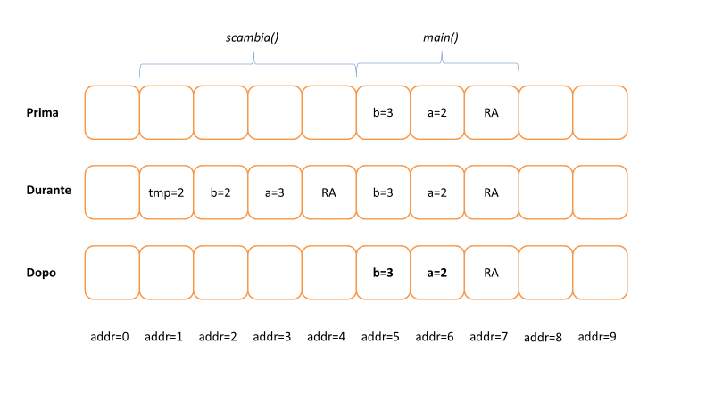
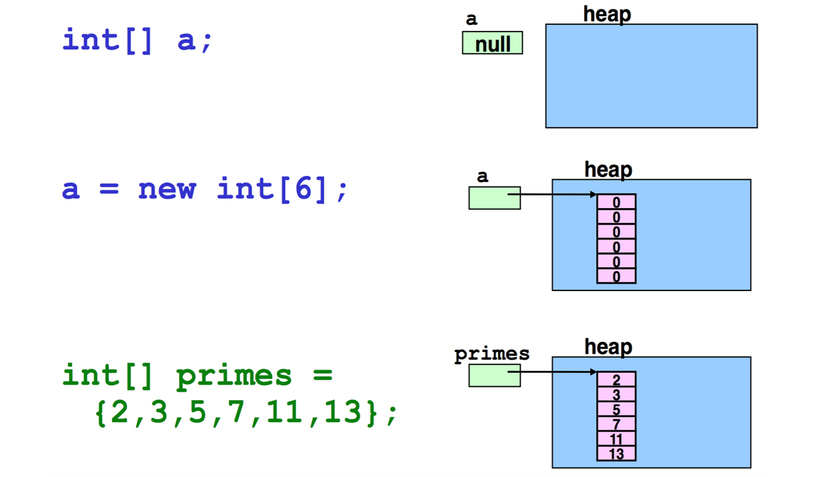
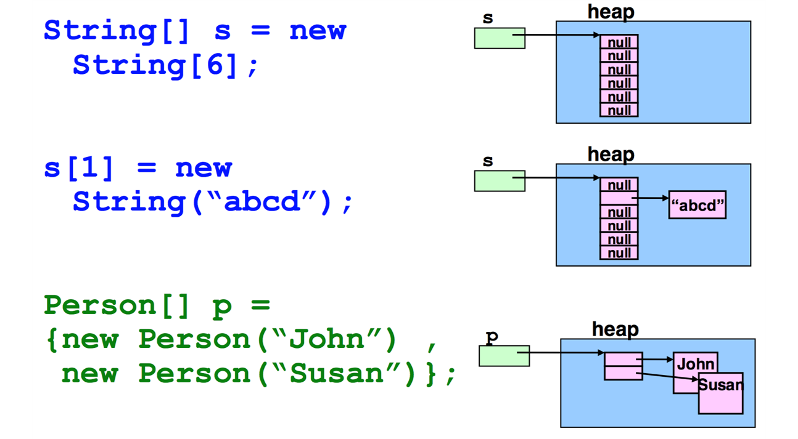

# Java Basics

In this chapter we will explain the basics of the Java language, from its 
history to the basic syntax of the language.

---

# Building and Running

### History, Development and Features of Java

- **1991**: a group led by James Gasling and Patrick Naughton at Sun 
Microsystems designed a programming languages, code-named _Green_, for
use in consumer devices, such as intelligent television.
- **1994**: the team realized that they could use the same technologies
to make a cool browser as the Internet grew and became more popular.
The first success of the team was represented by the introduction of the 
**_applets_**, Java code that can be located anywhere.
- **1996**: Java 1 (Netscape browser supports Java, popularity begins)
- **2005**: Java 5 (major enhancements)
- **2014**: **Java 8 LTS (support until 2022)**
- **2018**: **Java 11 LTS (support until 2023)***

-- 6 months release cycle begins --

- **2019**: Java 12, Java 13
- **2020**: Java 14, Java 15
- **2021**: Java 16, **Java 17 LTS (support until 2026)**

(see more: [Java version history - Wikipedia](https://en.wikipedia.org/wiki/Java_version_history))

### JDK Enhancement Proposal

- The **JDK Enhancement Proposal** (or **JEP**) is a process drafted by Oracle Corporation for collecting proposals for enhancements to the Java Development Kit and OpenJDK.
- JEPs serve as the long-term Roadmap for JDK Release Projects and related efforts.
- The JEP process is not intended to replace the **Java Community Process**, which is still required to approve changes in the Java API or language but rather to allow for OpenJDK committers to work more informally before becoming a formal Java Specification Request.

(see more: [JEP Index - OpenJDK](https://openjdk.java.net/jeps))

### Features

- Portable (Translated to bytecode)
- Pure object-oriented
- Statically typed
- Garbage collected
- Exceptions as a pervasive mechanism
- Shares syntax elements w/ C++ (reduced learning curve)

---

### Building and Running


```
$ cd java-core/src/main/java/com/nbicocchi/exercises/examples
$ javac PrimitiveLiterals.java
(builds PrimitiveLiterals.class. Unsuitable for large projects. Gradle uses build/ dir)

$ cd java-core/build/classes/java/main/
$ java -cp . com.nbicocchi.exercises.examples.PrimitiveLiterals

. . .

$ javap -cp . -verbose com.nbicocchi.exercises.examples.PrimitiveLiterals | grep major
major version: 61
```

(see more: [Java class file - Wikipedia](https://en.wikipedia.org/wiki/Java_class_file#General_layout))

### Compiled vs Interpreted

_Compiled_


_Interpreted_

(see more: [List of Java virtual machines - Wikipedia](https://en.wikipedia.org/wiki/List_of_Java_virtual_machines))

---


# Attributes, methods, conventions

### Program, files and classes
- A program is made of one or more packages, containing one or more files
- A file contains one public class and, optionally, multiple private classes. The file
name must be equal to the public class name.


### The main method
- In Java there are no traditional functions, but methods within classes
- The execution of a Java program starts from the **main** method:

```
public class Hello {
  public static void main(String[] args) {
    System.out.println("Hello world!");
  }
}
```

### Code blocks and Scope
- Java code blocks are the same as in C
- Each block is enclosed by **braces** { } and starts a new **scope** for the variables
- Variables can be declared everywhere within a scope

```
for (int i = 0; i < 10; i++) {
  int = 12;
  // ...
  int y;
  // ...
}
```

### Primitive Types


```
public class PrimitiveTypes {
  public static void main(String[] args) {
    byte a = 13;
    /* char is actually a 16 bit unsigned int */
    char b = 65;
    short c = 34;
    int d = 332;
    long e = 122;
    float f = 7.6F; // note: F
    double g = 12.3;
    boolean h = true;
  }
}
```

- No native support for unsigned integer types


### Literals
```
public static void main(String args[]) {
  int count = 987;
  int hexaVal = 0x7e4;
  int binary = 0b11010;
  int octalVal = 067;
  long longVal = 123L;
  float floatVal = 4534.99F;
  double cost = 19765.567d; // note: d
  char alpha = 'p';
  char ch1 = '\u0021';
  char ch2 = 65;
  boolean boolVal = true;
}
```

### The var keyword

- The **var** keyword was introduced
in Java 10.
- **Type inference is used with var
keyword. It allows the compiler
to detect automatically the
datatype of a variable based on
the surrounding context.**

```
// Java program to explain that var 
// can use to declare any datatype

class Demo1 {
  public static void main(String[] args) {
    var x = 100;     // int
    var y = 1.90;    // double
    var z = 'a';     // char
    var p = "tanu";  // string
    var q = false;   // string
  }
}
```

```
// Java program to demonstrate that var 
// cannot be used to declare instance and global variables

class Demo3 {
  // instance variable
  var x = 50;

  public static void main(String[] args) {
    System.out.println(x);
  }
}

```

```
// Java program to demonstrate that
// var cannot be used as a Generic type

import java.util.*;

class Demo4 {
  public static void main(String[] args) {
    // Generic list using var
    var<var> al = new ArrayList<>();
        
    // add elements
    al.add(10);
    al.add(20);
    al.add(30);
    
    // print the list
    System.out.println(al);
  }
}
```

### Implicit casting
- The compiler automatically performs **implicit casting** when the target type is wider than the source type. The picture below illustrates the direction of this casting. Any value of a given type can be assigned to the one on the right implicitly or below in the case of char.
- Normally, there is no loss of information when the target type is wider than the source type, for example, when we cast int to long. But it is not possible to automatically cast in the backward order (e.g. from long to int or from double to float).


### Explicit casting
- The considered **implicit casting** does not work when the target type is narrower than the source type.
- Programmers can apply **explicit casting** to a source type to get the type they want. It may lose information and precision.

```
double d = 2.00003;

// it loses the fractional part
long l = (long) d; // 2

// requires explicit casting because long is wider than int
int i = (int) l; // 2 

// requires explicit casting because the result is long (indicated by L)
int val = (int) (3 + 2L); // 5

// casting from a long literal to char
char ch = (char) 55L; // '7'
```

### Constants

- **A constant is a variable whose value cannot change once it has been assigned.**
- A constant can make our programs more easily understood by others.
- Constants are cached by the JVM, so using constants might improve performance.
- To define a variable as a constant, add the keyword final in front of its declaration.

```
final float PI = 3.1415F;
PI = 3.18;   // ERROR, no changes allowed
```

---

### Operators

- Operators follow C syntax:
  - arithmetical: ```+``` ```-``` ```*``` ```/``` ```%```
  - relational: ```==``` ```!=``` ```>``` ```<``` ```>=``` ```<=```
  - bitwise: ```&``` ```|``` ```^``` ```!``` ```>>``` ```<<```
  - logical: ```&&``` ```||``` ```!``` ```^```
  - assignment: ```=``` ```+=``` ```-=``` ```*=``` ```/=``` ```%=``` ```&=``` ```|=``` ```^=```
  - increment: ```++``` ```--```


- Chars can be treated as integers (e.g. switch)
- **Logical operators work ONLY on Booleans**
  - int is NOT considered a boolean value like in C


### Reference Types

- A **reference** is an entity that provides a way to access **objects**.
- Generally, you can't access an object without a reference to it.

```
Point p = new Point(2,3);
p.getX();
p.magnitude();

String s = new String("Hello world!");
s.length()
```

### Primitive vs Reference Types


```
// C
typedef struct point {
    float x;
    float y;
} point_t;

point_t *allocate_point(float x, float y) {
    point_t *p = malloc(sizeof(point_t));
    p->x = x;
    p->y = y;
    return p;
}

void free_point(point_t *p) {
    free(p);
}

int main() {
    point_t *p = allocate_point(2, 3);
    printf("(%f, %f)\n", p->x, p->y);
    free_point(p);
}
```

```
// Java
public class Point {
    int x;
    int y;
    
    public Point(int x, int y) {
        this.x = x;
        this.y = y;
    }
}

public class Application {
  public static void main(String[] args) {
    Point p = new Point(2, 3);
    System.out.printf("(%d, %d)\n", p.x, p.y);
  }
}
```

### References and Objects
- **References are primitive variables and are stored in the stack memory**
- **Objects are dynamically allocated (reside in the heap memory). Because of this, their lifecycle does not depend on any specific method’s lifecycle.**

```
public class Test {
  public static Point allocatePoint(int x, int y) {
    return new Point(x, y);
  }
  public static void main(String[] args) {
    Point p = allocatePoint(2, 3);
    System.out.println(p);
  }
}
```

### Methods
- Methods are blocks of code with a name that run when they are called
- Methods are functions contained within a class
- Methods receive **parameters** (many) and **return values** (one)
- Java programs always start from a call to the **_main method_**

```
public class Test {
  public static long method(int n) {
    return n * n;
  }
  
  public static void main(String[] args) {
    long n = method(20);
    System.out.println(n);
  }
}
// Outputs: 400
```

### Passing Parameters (Primitive)
- A method is a block of code with a name which only runs when it is called
- They are used to performing certain actions, and they are equivalent to C functions
- You can pass parameters to a method. Parameters can be **primitive types** or **object references**
- Parameters are always **passed by value (copy)**

```
public class Parameters {
    public static void swap(int a, int b) {
        int tmp = a;
        a = b;
        b = tmp;
    }

    public static void main(String[] args) {
        int a = 2;
        int b = 3;

        System.out.println(a);  // 2
        System.out.println(b);  // 3
        swap(a, b);
        System.out.println(a);  // 2
        System.out.println(b);  // 3
    }
}
```



### Passing Parameters (Objects)

```
public class Parameters {
  public static void main(String[] args) {
    Point p1 = new Point(0, 0);
    Point p2 = new Point(10, 10);
    
    System.out.println(p1);
    System.out.println(p2);
    swap(p1, p2);
    System.out.println(p1);  // 0, 0
    System.out.println(p2);  // 10, 10
  }
  public static void swap(Point p1, Point p2) {
    Point tmp = p1;
    p1 = p2;
    p2 = tmp;
  }
}
```


```
import java.awt.*;

public class Parameters {
  public static void main(String[] args) {
    Point p1 = new Point(0, 0);
    Point p2 = new Point(10, 10);
    System.out.println(p1);
    System.out.println(p2);
    move(p1, p2);
    System.out.println(p1);  // 10, 10
    System.out.println(p2);  // 0, 0
  }

  public static void swap(Point p1, Point p2) {
    Point tmp = new Point(p1);
    p1.setLocation(p2);
    p2.setLocation(tmp);
  }
}
```


### Comments

```
/* 
 * this comment is so long 
 * that it needs two lines 
 */ 

// comment on one line 

/**
  * Set x, y, and z coordinates. 
  * 
  * @param x the x coordinate. 
  * @param y the y coordinate. 
  * @param z the z coordinate. 
  */
```


### Coding Conventions

```
class ClassName {
	public final double PI = 3.14;
	private int attributeName;
	
	public void methodName {
		int var;
		if (var == 0) {
			/* this is a comment*/
		}
	}
}
```

(see more: [Java Coding Standard - pdf](https://github.com/nbicocchi/java-core/blob/main/assets/books/Java-Coding-Standard.pdf)
(see more: [Java Coding Standard - xml](https://github.com/nbicocchi/java-core/blob/main/assets/books/Java-Coding-Standard.xml))

_In IntelliJ: Code -> Reformat File... -> Import ->**Java-Coding-Standard.xml**_

---

# Decision statements

### if statement
```
// Syntax
if (condition1) {
  // executed if 
  // condition1 is true
} else if (condition2) {
  // executed if 
  // condition1 is false and condition2 is true
} else {
  // executed if
  // condition1 is false and condition2 is false
}
```

```
// Example
int time = 22;
if (time < 10) {
  System.out.println("Good morning.");
} else if (time < 20) {
  System.out.println("Good day.");
} else {
  System.out.println("Good evening.");
}
```

### switch statement

```
// Syntax
switch(expression) {
  case x:
    // code block
    break;
  case y:
    // code block
    break;
  default:
    // code block
}
```

```
// Example
char grade = ‘B’;

switch(grade) {
    case 'A':
        System.out.println("Excellent!");
        break;
    case 'B':
    case 'C':
        System.out.println("Well done");
        break;
    case 'D':
        System.out.println("Danger zone");
        break;
    default:
        System.out.println("Invalid grade");
}
```

### switch statement (enhanced)

```
// Enhanced Switch
switch (grade) {
  case 'A' -> System.out.println("Excellent!");
  case 'B', 'C' -> System.out.println("Well done");
  case 'D' -> System.out.println("Danger zone");
  default -> System.out.println("Invalid grade");
}
```

---

# Loops

### Loop statements
- loop statements
  - do-while loop
  - while loop
  - for-each loop
- jump statements
  - break statement
  - continue statement


### do-while statement

```
// Syntax
do {
    // code block to be executed
} while (condition);

// Example
int i = 0;
do {
    System.out.println(i++);
} while (i < 5);
```

### while statement

```
// Syntax
while (condition) {
    // code block to be executed
}

// Example
int i = 0;
while (i < 5) {
    System.out.println(i++);
}
```

### for statement

```
// Syntax (traditional)
for (statement 1; statement 2; statement 3) {
    // code block to be executed
}

// Example (traditional)
for (int i = 0; i <= 10; i++) {
    System.out.println(i);
}
```

```
// Syntax (for-each)
for (type variableName: arrayName) {
    // code block to be executed
}

// Example (for-each)
String[] cars = {
  "Supra",
  "Lancer",
  "Impreza"
};

for (String i: cars) {
    System.out.println(i);
}
```

### break-continue statements

- The **break** statement can be used to jump out of a loop.
- The **continue** statement breaks one iteration (in the loop), but continues with the next iteration instead of jumping out.


```
// Example (break)
for (int i = 0; i < 10; i++) {
  if (i == 4) {
    break;
  }
  System.out.println(i);
} // 0,1,2,3
```

```
// Example (continue)
for (int i = 0; i < 10; i++) {
  if (i == 4) {
    continue;
  }
  System.out.println(i);
} // 0,1,2,3,5,6,7,8,9
```

---

# Arrays

### Array

- **An array is an ordered sequence of variables of the same type which are accessed through an index**
- Can contain both **primitive types** or **object references** (not the actual objects!)
- Array **size** must be defined at creation time (cannot be changed afterwards)
- **Declaration** is not **creation**!

```
// declaration
int[] v;

// creation
v = new int[256];

// declaration and creation
int[] v = new int[256];
int[] v = {2,3,5,7,11,13};
```

### Example - Primitive Types



### Example - Object Reference



### Operations on Arrays

- Java checks array bounds **at runtime**

```
int[] v = new int[16]
System.out.println(v[20])
// ArrayIndexOutOfBoundsException
```

- The length of an array (the maximum capacity of the array) is provided by the **attribute length**.
- Not to be confused with the **method size()** provided by the Collection interface!

```
String[] args;

/* explicit index */
for(int i = 0; i < args.length; i++) { 
	System.out.println(args[i]);
    //... 
} 

/* implicit index 
(also called for-each syntax) */
for(String arg: args) { 
	System.out.println(arg);
	//... 
}
```

- An array reference is not a pointer to the first element of the array
- It is a reference to the array object 
- **Arithmetic on pointers does not exist in Java**

```
int[] v1 = new int[16];
int[] v2 = v1 + 2; // runtime error!
```

### Multidimensional Arrays

```
String[][] table = {{"a", "b", "c"}, {"d", "e", "f"}};
System.out.println(table);
System.out.println(Arrays.toString(table));
System.out.println(Arrays.deepToString(table));

// switching rows only requires switching references
String[] tmp = table[0];
table[0] = table[1];
table[1] = tmp;
```


### java.util.Arrays

- Alter-ego of java.util.Collections for Arrays
- This class contains various methods for manipulating arrays such as **sorting, searching, filling, printing or being viewed as Collections**
  - copyOf()
  - fill()
  - sort()
  - binarySearch()
  - toString()
  - deepToString()

```
 int[] v = new int[8];
 Arrays.fill(v, 10);

 int[] copy = Arrays.copyOf(v, v.length);

 int[] w = {1,3,2,6,5,4,7,9,8};
 Arrays.sort(w);

 System.out.println(Arrays.binarySearch(w, 3)); // 2
 System.out.println(Arrays.binarySearch(w, 13)); // -10
```

### System.arraycopy()

- **System.arraycopy()** copies an array from the specified source array, beginning at the specified position, to the specified position of the destination array. The number of components copied is equal to the length argument.
- Advised because simple and fast!

```
public static void arraycopy(
  Object src, int srcPos,
  Object dest, int destPos,
  int length)
```

```
int[] v1 = new int[8];
int[] v2 = new int[8];

Arrays.fill(v1, 10);
Arrays.fill(v2, 12);

// manual array copy
// System.arraycopy(v1, 0, v2, 4, 4);
for (int i = 0; i < 4; i++) {
    v2[i+4] = v1[i];
}
System.out.println(Arrays.toString(v1));
// 10,10,10,10,10,10,10,10
System.out.println(Arrays.toString(v2));
// 12,12,12,12,10,10,10,10
```

### java.util.ArrayList

- The ArrayList class is a **resizable array**, which can be found in the java.util package.
- The difference between a built-in array and an ArrayList in Java, is that the size of an array cannot be modified (if you want to add or remove elements to/from an array, you have to create a new one).

```
ArrayList<String> l = new ArrayList<>();

l.add("nicola");
l.add("rachele");
l.remove("nicola");

System.out.println(l.get(0));
System.out.println(l.contains("mario"));
```

---

# Strings

### String

- In C char[] == string
```
char s[] = “literal”;
```

- In Java **char[] != String**
- More specifically, in Java, Strings are instances (objects) of a specific class (java.lang.String)
- **Strings are immutable objects**

```
char[] s = {'h','e','l','l','o’};
String s = “hello”;
String s = new String(“Hello”);
```

### Strings in memory

- When created using String s = "something" they are stored in a special pool in which the same string is stored only once

```
// memory use
String first = "Baeldung";

// no actual memory use
String second = "Baeldung";

// True
System.out.println(first == second);
```

- When created using the **new** operator, Strings are stored in memory (heap) as standard objects

```
// memory use
String first = new String("Baeldung");

// memory use
String second = new String("Baeldung");

// memory use
String third = "Baeldung";

// False
System.out.println(first == second);

// False
System.out.println(first == third);
```

### Reference Operators (equals vs ==)

- The **== operator** verifies if two references objects point to the same object
- The **equal() method**, instead, verifies if two objects (any object!) have the same internal state

When created using the new operator, Strings are stored in memory (heap) as standard objects

```
String s1 = “hello”;
String s2 = ”hello”;

// true! Same object!
if (s1 == s2) { ... }

// true
if (s1.equals(s2)) { ... }

String s1 = new String(“hello”);
String s2 = new String(”hello”);

// false! Different objects!
if (s1 == s2) { ... }

// true
if (s1.equals(s2)) { ... }
```

### String methods

- **charAt()**		Returns the character at the specified index (position)
- **compareTo()**	Compares two strings lexicographically
- **concat()**		Appends a string to the end of another string
- **contains()**	Checks whether a string contains a sequence of characters
- **endsWith()**	Checks whether a string ends with the specified character(s)
- **isEmpty()**		Checks whether a string is empty or not
- **length()**		Returns the length of a specified string
- **replace()**		Searches a string for a specified value, and returns a new string where those values are replaced
- **split()**			Splits a string into an array of substrings
- **startsWith()**	Checks whether a string starts with specified characters
- **substring()**		Returns a new string which is the substring of a specified string
- **valueOf()**		Returns the string representation of the specified value

### The + operator

- It is used to concatenate 2 strings
```
String s = “This string” + “is made by two strings”;
```

- Works also with other types (automatically converted to string)

```
System.out.println(“pi = ” + 3.14);
System.out.println(“x = ” + x);
```

### StringBuilder

- Being Strings immutable, **when two Strings are concatenated using +, the two Strings are actually discarded and a new one (containing their concatenation) is instantiated.**
- This process is **slow**
- StringBuilder provides a better way for concatenating Strings

```
public static void main(String[] args) {
    // slow version
    String s = "";
    for (int i = 0; i < 100; i++) {
        s += 'a';
    }
    System.out.println(s);
}
```

```
public static void main(String[] args) {
    // fast version using StringBuilder
    StringBuilder sb = new StringBuilder();
    for (int i = 0; i < 100; i++) {
        sb.append('a');
    }
    System.out.println(sb.toString());
}
```

---

# Using the Terminal

### Standard Streams

- **System.in** is an **InputStream** which is typically connected to keyboard input of console programs.
- **System.out** is a **PrintStream** to which you can write characters. It normally outputs the data you write to it to the console/terminal.
- **System.err** is a **PrintStream**. It works like **System.out** except it is normally only used to output error texts. Some programs (like Eclipse) will show the output to **System.err** in red text, to make it more obvious that it is error text.

### PrintStream Methods

- Print a string
```
void print(String s)
```

- Print a String and terminate the line
```
void println(String s)
```

- Write a formatted string using the specified format string and arguments
```
void printf(String format, Object... args)
```

- Return a formatted string using the specified format string and arguments
```
String String.format(String format, Object... args)
```

### Scanner

- **Scanner is a text scanner which can parse primitive types and strings using regular expressions.**
- Scanner **breaks its input into tokens** using a delimiter pattern, which by default matches whitespace.
- The resulting tokens may then be **converted into values of different types** using the various next methods.

```
/* from stdin */
Scanner sc = new Scanner(System.in);
int i = sc.nextInt();

/* from a file */
Scanner sc = new Scanner(new File("myNumbers"));
while (sc.hasNextLong()) {
    long aLong = sc.nextLong();
}
```

---

# Random Numbers

### Random Numbers

- Math.random()
- java.util.Random
- java.util.random.RandomGenerator

```  
Random generator = new Random();
  
generator.nextInt()	// [MIN_VALUE, MAX_VALUE]
generator.nextDouble()	// [0, 1]
generator.nextBoolean()	// [true, false]
```

```
RandomGenerator generator = RandomGenerator.getDefault();
RandomGenerator generator = RandomGenerator.of("L128X256MixRandom");

generator.nextInt()	// [MIN_VALUE, MAX_VALUE]
generator.nextDouble()  // [0, 1]
generator.nextBoolean()	// [true, false]
```


### Wisdom Pills
*The first rule of functions is that they should be small.*

*The second rule of functions is that they should be smaller than that.*

*This is not an assertion that I can justify. I can’t provide any references to research that shows that very small functions are better. What I can tell you is that for nearly four decades I have written functions of all different sizes. I’ve written several nasty 3,000-line abominations. I’ve written scads of functions in the 100 to 300 line range. And I’ve written functions that were 20 to 30 lines long.*

*What this experience has taught me, through long trial and error, is that functions should be very small.*

Robert C. Martin - Clean Code 